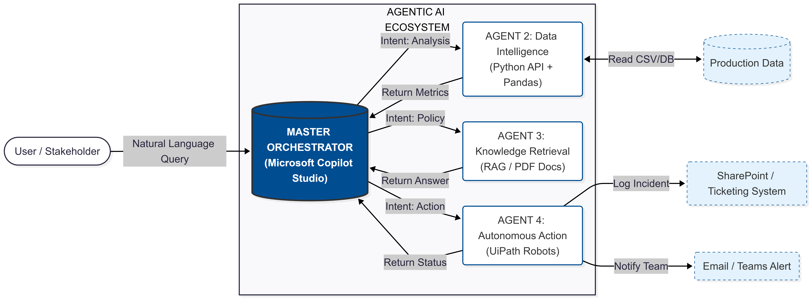

# Multi Agentic Enterprice Orchestrator

   

## 🚀 Executive Summary
This project demonstrates a **Multi-Agent Orchestration System** designed for Industry 4.0 environments. It bridges the gap between **Generative AI** and **Operational Technology (OT)**, allowing plant managers to query real-time production metrics and trigger physical remediation workflows using natural language.

The system uses a **Hub-and-Spoke Agentic Architecture** where **Microsoft Copilot Studio** acts as the central reasoning engine, coordinating specialized sub-agents for data analysis, compliance retrieval (RAG), and autonomous action (RPA).

---

## 🏗️ System Architecture


The architecture follows a closed-loop control pattern:
1.  **Sense:** The Python Agent fetches live telemetry (Defect Rates, Yield).
2.  **Think:** The Orchestrator (Copilot) evaluates data against policy documents (RAG).
3.  **Act:** The UiPath Robot executes remediation workflows (SharePoint Logging, Machine Adjustment).

---

## 📂 Repository Structure

```text
agentic-industrial-orchestrator/
├── 📂 backend_api/           # Agent 2: Python/FastAPI Data Intelligence Service
│   ├── agents/               # Logic for statistical analysis
│   ├── data/                 # Local datasets (production_logs.csv)
│   ├── agent2_api.py         # Main entry point for REST API
│   └── requirements.txt      # Python dependencies
│
├── 📂 copilot_config/        # Agent 1: Microsoft Copilot Studio Configuration
│   └── defect_retrieval_topic.yaml  # YAML definition of the conversation logic
│
├── 📂 uipath_robot/          # Agent 4: Autonomous Action Bot
│   ├── Main.xaml             # The actual UiPath workflow source code
│   └── remediation_workflow.md  # Detailed functional specification
│
├── 📂 architecture/          # System Design Assets
│   └── system_diagram.png    # High-level architectural view
│
└── README.md                 # Project Documentation
```
---

---

## 🧩 The Agent Ecosystem

### 🤖 Agent 1: The Orchestrator (Microsoft Copilot Studio)
* **Role:** The "Brain" - Handles user intent and routes tasks.
* **Key Feature:** Dynamic conversation chaining (e.g., if Defect Rate > 2%, it automatically asks to trigger a fix).

### 📊 Agent 2: Data Intelligence (Python + FastAPI)
* **Role:** The "Eyes" - Quantitative Analysis.
* **Stack:** `FastAPI`, `Pandas`, `Uvicorn`.
* **Function:** Exposes a local REST API via **ngrok** to calculate real-time statistics from `manufacturing_metrics.csv`.

### 📚 Agent 3: Knowledge Retrieval (RAG)
* **Role:** The "Memory" - Compliance Checking.
* **Function:** Uses Vector Search to query unstructured PDF documents (Standard Operating Procedures).
* **Goal:** Verifies if current production metrics violate ISO-9001 safety policies.

### ⚡ Agent 4: Autonomous Action (UiPath RPA)
* **Role:** The "Hands" - Remediation.
* **Function:** Attended robot triggered by API.
* **Workflow (`Main.xaml`):**
    1.  Receives Defect Rate payload.
    2.  Logs a high-priority incident in **SharePoint**.
    3.  Sends an alert email to the shift supervisor.

---

## 🛠️ Setup & Installation

### 1. Backend Setup (Agent 2)
```bash
cd backend_api
pip install -r requirements.txt
python agent2_api.py
# In a separate terminal, expose the port:
ngrok http 8000
```


### 2. UiPath Robot (Agent 4)
* Open `uipath_robot/Main.xaml` in **UiPath Studio**.
* Publish the package to your local Orchestrator or run in "Debug" mode to test the SharePoint integration.

### 3. Copilot Configuration
* Import the YAML logic from `copilot_config/` into Copilot Studio.
* Update the **HTTP Request** node with your active `ngrok` URL.

---

## 📸 Usage Scenario (The "Golden Path")

> **User:** "What is the current defect rate?"
>
> **System:** "The current defect rate is **2.72%**." *(Fetched via Python)*

> **User:** "Is that compliant?"
>
> **System:** "No. Policy Q-202 limits defects to 2.0%." *(Fetched via RAG)*

> **User:** "Initiate remediation."
>
> **System:** "✅ Incident ticket **#INC-9921** created in SharePoint." *(Triggered via UiPath)*

---

## 🔮 Future Roadmap
* **Self-Healing:** Fully automate the loop to trigger robots without human confirmation for critical safety events.
* **Vision AI:** Integrate Computer Vision at the edge to detect defects visually before they hit the database.

---
*Engineered by **Sai Kumar***

